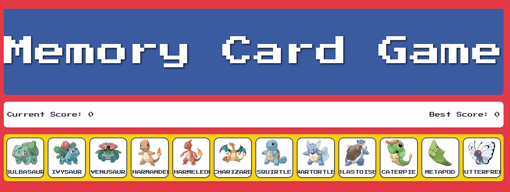

## Memory Card Game

Hey there! Welcome to my **Memory Card Game** project! This is a fun little app I made to test your memory skills with some of our favorite Nintendo characters. It’s fast, colorful, and works great on any device (yep, mobile too!).

---

Features

- **Random Card Shuffle**: Every click shuffles the cards—no two games are the same!
- **Score Tracking**: Keeps track of your current and best scores, so you always have a reason to beat yourself.
- **Responsive Design**: Whether you’re on your desktop, tablet, or phone, it looks awesome.

---

## Screenshot




---

## How to Play

1. Click on a card. 
2. Don’t click the same card twice, or you’ll lose your streak!  
3. Rack up points and see if you can beat your best score.

---

##  Play the Game!

You can try it out here: **[ Memory Card Game on Netlify](#)** ([Add your Netlify link here](https://snazzy-tapioca-218543.netlify.app/))

---

## Running Locally

Here’s how you can run it on your own machine:

1. Clone the repo:
   ```bash
   git clone <repository-url>
   ```
2. Install the dependencies:
   ```bash
   npm install
   ```
3. Start the development server:
   ```bash
   npm run dev
   ```
4. Open it in your browser at `http://localhost:5173/`.

---

## Project Structure


```plaintext
memory-card-game/
├── public/
│   └── assets/         # Images, logos, and audio files
├── src/
│   ├── components/     # React components (Card, Gameboard, Scoreboard, Header)
│   ├── services/       # API services (e.g., fetchPokemon)
│   ├── styles/         # CSS files for styling
│   ├── App.jsx         # Main app component
│   └── main.jsx        # Entry point
├── README.md           # You’re looking at it!
└── package.json        # Project dependencies
```

---